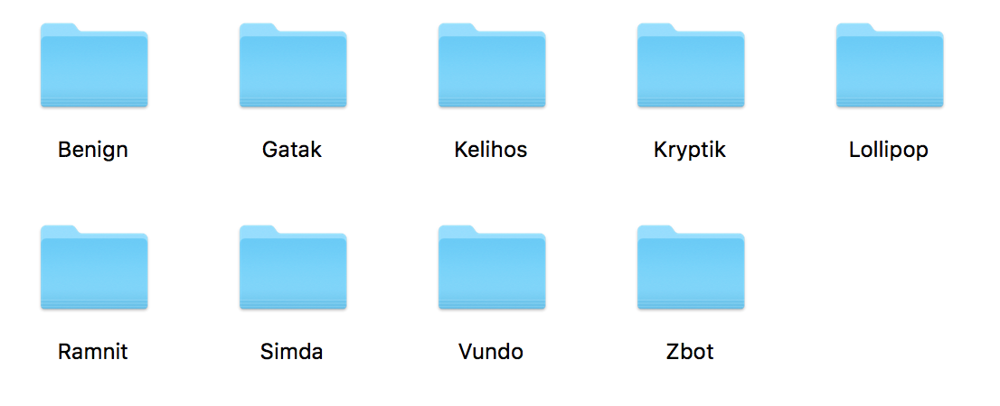

# Malware Classification

Table of Contents

* [Desciprtion](#desciprtion)
* [Dependency](#dependency)
* [Get the Data](#get-the-data)
* [Setup](#setup)
* [Results](#results)
* [Team](#team)

## Desciprtion

The detection of malicious software (malware) is an important problem in cyber security, especially as more of society becomes dependent on computing systems.

This is the implementation of MalConv proposed in [Malware Detection by Eating a Whole EXE.](https://arxiv.org/pdf/1710.09435.pdf)

**Our model:**

## Dependency

Please make sure each of them is installed with the correct version

- numpy (1.14.0)
- pytorch (0.4.0)
- sklearn (0.19.1)
- matplotlib (2.1.2)

We used python **2.7** for this project. 

## Get the Data

We took our data from the [BIU Cyber center](https://cyber.biu.ac.il/).

You can use alternative data from  [Microsoft Malware Classification Challenge](https://www.kaggle.com/c/malware-classification/data).

### Labels
Each training and test example is assigned to one of the following labels:

| Label | Description |
| --- | --- |
| 1 | Gatak |
| 2 | Kelihos |
| 3 | Kryptik |
| 4 | Lollipop |
| 5 | Benign |
| 6 | Ramnit |
| 7 | Simda |
| 8 | Vundo |
| 9 | Zbot |

## Setup
### Preparing data
##### Step 1
Please prepare a folder with the data, each label with separate folder. 

It should look like this:

##### Step 2
On **classes.txt**:

You need put the path of the main directory (containing all the labels's folder) on the first line.

On the second line you need to specify which labels you want to check.

For example: 

        /Users/haimgil/Desktop/malwareData
        Benign Ramnit Zbot Kelihos
In this example we checked only 4 classes.
##### Step 3
On **Main.py**:

Edit **num_of_classes** to match the number of labels you putted on the second line in **classes.txt**

### Running

Run the following command for training progress:

        python Main.py <use_cpu> <batch_size> <num_of_classes>
        Example 1 : python Main.py 2 64 9
        Example 2 : python Main.py
        
### Results
We tested our model on 4 classes: Benign, Ramnit, Zbot and Kelihos.

When we tested on 9 classes we achieved 85% at most. The reason is that most of the classes has lack of data so we decided to check only the classes above.
We achieved the following result when we tested 4 classes:

        python Main.py <use_cpu> <batch_size> <num_of_classes>
        Starting epoch number 30
        Epoch 30, 12% 	 train_loss: 1.45 took: 76.98s
        Epoch 30, 25% 	 train_loss: 0.50 took: 75.12s
        Epoch 30, 37% 	 train_loss: 1.54 took: 74.52s
        Epoch 30, 50% 	 train_loss: 0.85 took: 73.90s
        Epoch 30, 62% 	 train_loss: 1.02 took: 75.64s
        Epoch 30, 75% 	 train_loss: 0.93 took: 74.69s
        Epoch 30, 87% 	 train_loss: 0.49 took: 73.12s
        Epoch 30, 100% 	 train_loss: 1.04 took: 68.78s
        Starting validation
        Got 90.17% score in test and took 105.91 seconds.
        Epoch num 30 took 698.74 seconds and got 97.33% score in training.
        Best test score was 92.35%.
        

## Team
<a href="https://github.com/haimgil1" target="_blank">**Haim Gil**</a> | <a href="https://github.com/yarden95c" target="_blank">**Yarden Cohen**</a> 

